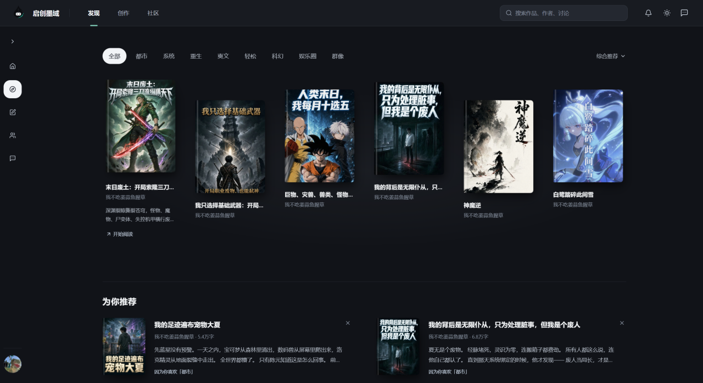
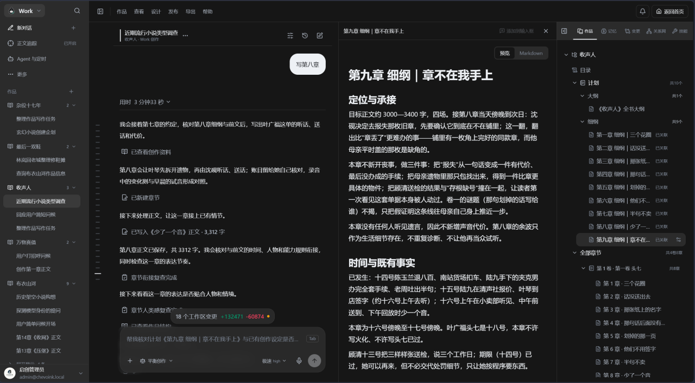
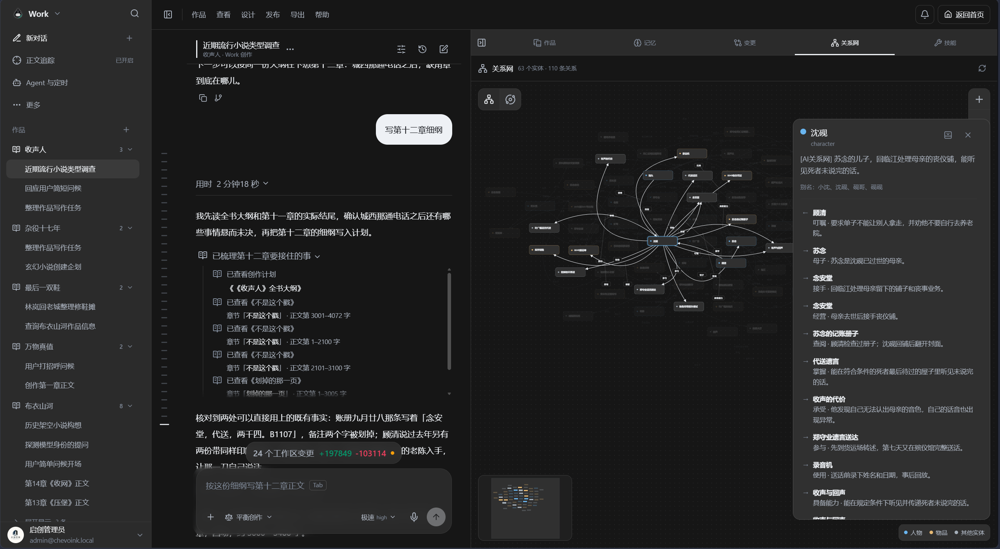
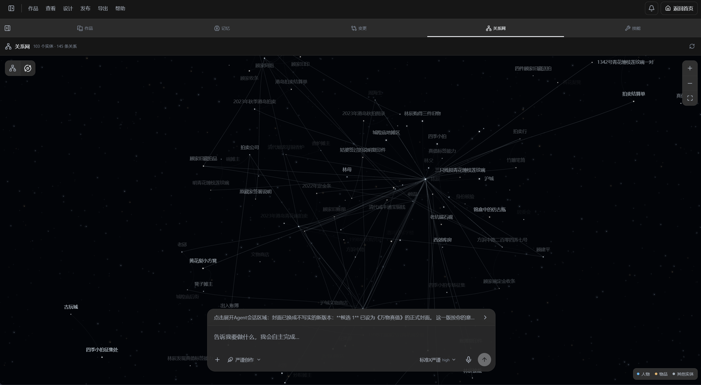
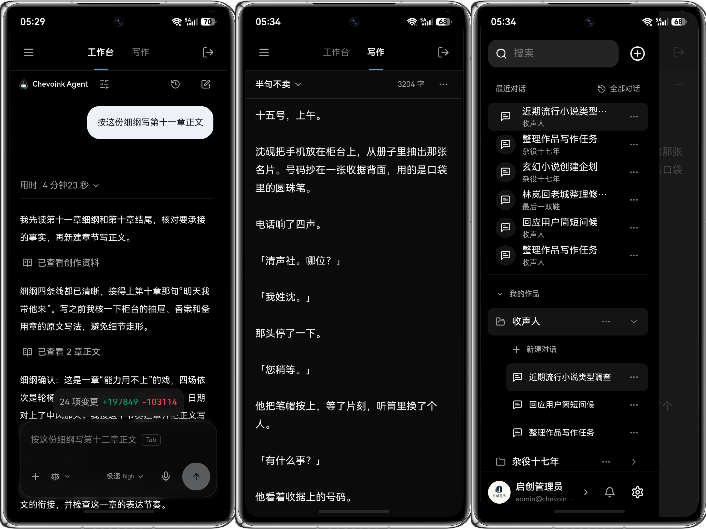
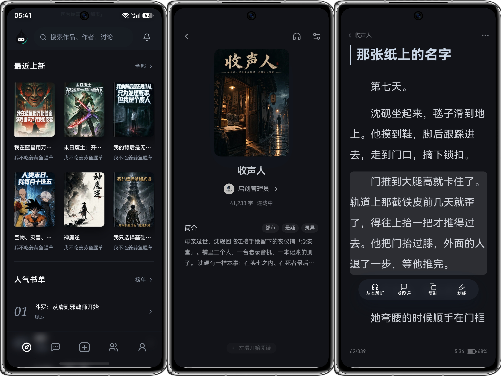
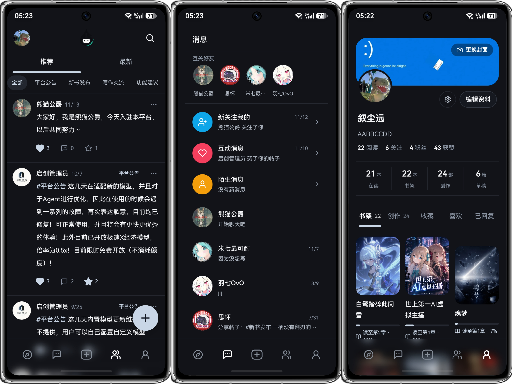
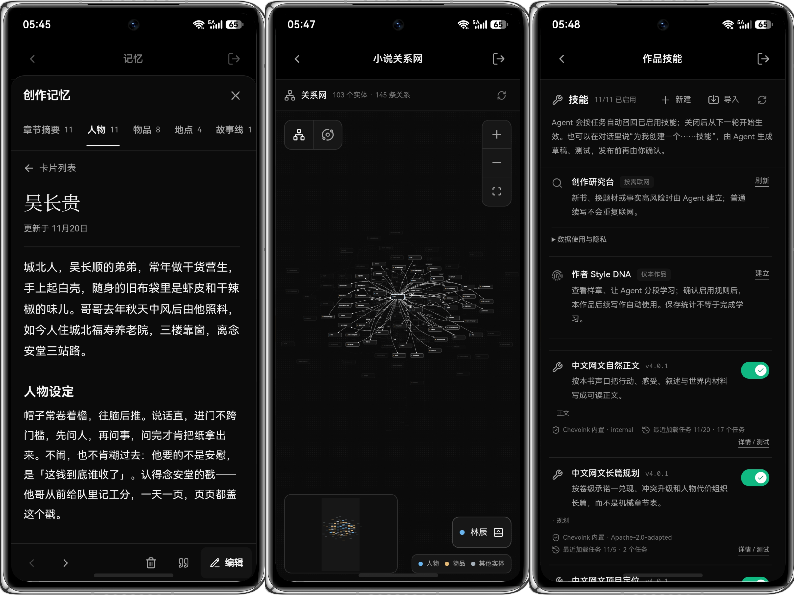
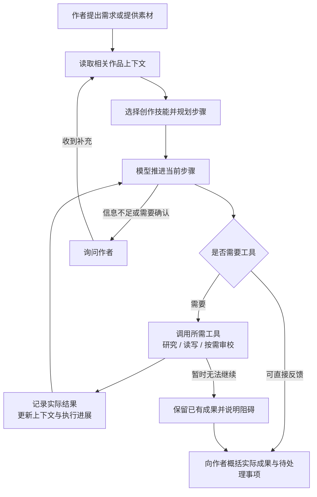
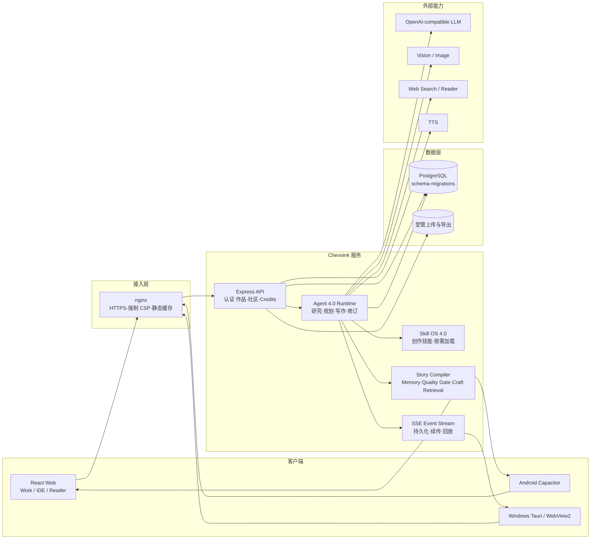

<p align="center">
  <a href="https://chevoink.chevolink.com">
    
  </a>
</p>

<h3 align="center">一念启创，落墨成域。</h3>

<p align="center">
  以 AI 为创作伙伴，连接灵感、作品与读者。<br>
  与 Chevoink Agent 一起研究、规划、写作与改稿，在这里创作小说，也发现、阅读与分享故事。<br>
  <sub>Web · Windows · Android</sub>
</p>

<p align="center">
  <a href="https://github.com/Xcy8010/chevoink/releases"></a>
  <a href="https://github.com/Xcy8010/chevoink/actions/workflows/ci.yml"></a>
  <a href="https://github.com/Xcy8010/chevoink/stargazers"></a>
  <a href="#license"></a>
  <a href="#交流群"></a>
</p>

<p align="center">
  <a href="https://chevoink.chevolink.com"><strong>在线体验</strong></a> ·
  <a href="#产品预览">产品预览</a> ·
  <a href="#功能一览">核心能力</a> ·
  <a href="#快速开始">快速开始</a> ·
  <a href="https://github.com/Xcy8010/Chevoink/releases/latest">客户端下载</a> ·
  <a href="#交流群">社区交流</a>
</p>

<p align="center"><strong>简体中文</strong> · <a href="./README.en.md">English</a></p>

---

## 产品预览

### 桌面端

<table>
  <tr>
    <td align="center"><a href="docs/assets/previews/desktop-discover.png"></a><br>发现页与个性化推荐</td>
    <td align="center"><a href="docs/assets/previews/desktop-studio.png"></a><br>创作对话与章节细纲</td>
  </tr>
  <tr>
    <td align="center"><a href="docs/assets/previews/desktop-relationships.png"></a><br>关系网与人物详情</td>
    <td align="center"><a href="docs/assets/previews/desktop-galaxy.png"></a><br>三维星系关系网</td>
  </tr>
</table>

### 移动端

<table>
  <tr>
    <td align="center"><a href="docs/assets/previews/mobile-writing.jpg"></a><br>创作工作台、正文编辑与对话列表</td>
    <td align="center"><a href="docs/assets/previews/mobile-reading.jpg"></a><br>新书发现、作品详情与阅读</td>
  </tr>
  <tr>
    <td align="center"><a href="docs/assets/previews/mobile-community.jpg"></a><br>社区、消息与个人书架</td>
    <td align="center"><a href="docs/assets/previews/mobile-memory.jpg"></a><br>创作记忆、关系网与作品技能</td>
  </tr>
</table>

## Chevoink Agent 4.0

Chevoink Agent 是围绕作品协作的 AI 创作伙伴，帮助作者研究资料、梳理设定、规划情节、撰写章节和修改稿件。

- **创作工作区**支持 Work、IDE 和手机布局。手机上发出的消息和写作任务进度会同步到电脑上打开的同一对话。在「设置 → 设备管理」可以查看已登录的手机和电脑、网络所在地及最近活动时间，验证密码后可让指定设备退出。
- **作品资料与技能**：结合设定、知识集和创作技能开展写作，支持管理个人技能。
- **审校与修订**：提供章节连续性与表达质量检查，辅助定位问题、修改和保存版本。
- **创作记忆**：续写时可按章补记人物、物品和故事线。在记忆卡中查看最新变化，在关系网中查看人物与物品如何关联。
- **联网查证**：可以让 Agent 查资料并打开原文。使用仅文本模型时，明确要求联网且任务已有相应权限，平台会将带来源的材料交给原模型作答。
- **创作进度**：对话中可看到 Agent 正在核对或写作的具体内容。点开一项进度，即可查看相关工具的实际结果。

支持内置模型、自定义 OpenAI 兼容服务，以及通过本地连接器接入 LM Studio、Ollama 等本地模型。本地模型所在电脑需保持在线，配置方式见[本地模型说明](docs/LOCAL-MODELS.md)。

### 运行流程

Agent 围绕当前作品推进任务，按需要选择工具，并根据实际执行结果继续处理。


```mermaid
flowchart TD
  A[作者提出需求或提供素材] --> B[读取相关作品上下文]
  B --> C[选择创作技能并规划步骤]
  C --> D[模型推进当前步骤]
  D --> E{是否需要工具}
  E -->|需要| F[调用所需工具<br/>研究 / 读写 / 按需审校]
  F --> G[记录实际结果<br/>更新上下文与执行进展]
  G --> D
  E -->|可直接反馈| H[向作者概括实际成果与待处理事项]
  D -->|信息不足或需要确认| I[询问作者]
  I -->|收到补充| B
  F -->|暂时无法继续| J[保留已有成果并说明阻碍]
  J --> H
```

写作和修改通过实际写入保存，审校与修订按任务要求进行。聊天、检索和规划不必进入章节写作或审查。最终反馈说明**写了什么或改了什么、保存在哪里、还有什么未完成**；执行进展可在任务窗口查看。

### 系统架构


```mermaid
flowchart LR
  subgraph Client[客户端]
    WEB[React Web<br/>Work / IDE / Reader]
    APP[Android Capacitor]
    WIN[Windows Tauri / WebView2]
  end
  subgraph Edge[接入层]
    NGINX[nginx<br/>HTTPS·强制 CSP·静态缓存]
  end
  subgraph Service[Chevoink 服务]
    API[Express API<br/>认证·作品·社区·Credits]
    LOOP[Agent 4.0 Runtime<br/>研究·规划·写作·修订]
    SKILL[Skill OS 4.0<br/>创作技能·按需加载]
    STORY[Story Compiler<br/>Memory·Quality Gate·Craft Retrieval]
    SSE[SSE Event Stream<br/>持久化·续传·回放]
  end
  subgraph Data[数据层]
    PG[(PostgreSQL<br/>schema·migrations)]
    FILES[(受管上传与导出)]
  end
  subgraph Providers[外部能力]
    LLM[OpenAI-compatible LLM]
    VISION[Vision / Image]
    SEARCH[Web Search / Reader]
    TTS[TTS]
  end
  WEB --> NGINX
  APP --> NGINX
  WIN --> NGINX
  NGINX --> API
  API --> LOOP
  LOOP --> SKILL
  LOOP --> STORY
  LOOP --> SSE
  API --> PG
  LOOP --> PG
  API --> FILES
  LOOP --> LLM
  LOOP --> VISION
  LOOP --> SEARCH
  API --> TTS
  SSE --> WEB
  SSE --> APP
  SSE --> WIN
```

### 连续创作与模型选择

在原任务中保留作品上下文和创作资料，暂停后可点击「继续」，也可在任务窗口查看进度与历史。

在创作区设置的「模型分工」中，为不同工作选择内置或自定义模型及推理强度；设置可应用于全局或当前作品。也可以直接在对话中要求切换模型或创作模式。模型用量和工具费用可在账户用量页查看。

切换任务时，已加载的对话会直接显示。章节、模型或右侧面板需要较长时间读取时，仅对应区域显示骨架。再次打开记忆面板会先显示已读取的进度和卡片数，再更新变化的数据。

## 快速导航

| 想做什么 | 去哪里 |
| --- | --- |
| 直接体验产品 | [线上地址](https://chevoink.chevolink.com)（网页端，无需安装） |
| 安装安卓 APP | [下载与安装教程](#下载与安装) · [Releases 页面](https://github.com/Xcy8010/chevoink/releases) |
| 安装 Windows 客户端 | [选择适合的 Windows 安装包](#下载与安装) · [Windows 客户端说明](desktop/windows/README.md) |
| 了解怎么用 | [使用教程](#使用教程) |
| 了解功能 | [功能一览](#功能一览) |
| 了解 Agent 4.0 | [运行流程](#运行流程) · [系统架构](#系统架构) |
| 本地跑起来 | [快速开始](#快速开始) |
| 了解架构 | [技术栈](#技术栈) · [目录结构](#目录结构) |
| 深入工程细节 | [工程文档](./docs/ENGINEERING.md)（[English](./docs/ENGINEERING.en.md)）· [开发规范](./docs/DEVELOPMENT-STANDARDS.md)（[English](./docs/DEVELOPMENT-STANDARDS.en.md)）· [Agent 评测说明](./tests/agent-evals/README.md) |
| 部署上线 | [部署与发布](#部署与发布) · [环境变量](#环境变量) |
| 交流讨论 | [QQ 交流群 158443235](#交流群) |

## 下载与安装

Windows 和 Android 安装包集中在同一个 [GitHub 最新版本](https://github.com/Xcy8010/Chevoink/releases/latest)，页面附有更新说明和 SHA-256 校验值。

| 设备 | 选择哪个安装包 | 如何使用 |
| --- | --- | --- |
| Windows x64，已安装 WebView2 或可联网获取运行时 | Windows 1.0.8 普通版，文件名以 `_x64-setup.exe` 结尾 | 下载并运行安装程序。后续桌面客户端版本通过手动安装更新。 |
| Windows x64，需要离线安装 WebView2 | Windows 1.0.8 内嵌运行时版，文件名含 `webview2-offline` | 安装包自带 WebView2，两种安装包提供相同的创作功能。 |
| Android | 已签名的 Android 1.0.18 APK，也可[从官网直接下载](https://chevoink.chevolink.com/download/chevoink.apk) | 安装后可在应用内检查更新，按提示下载并确认安装。 |

当前 Windows 安装包采用未签名的手动分发方式。桌面应用中的外部链接和账号中心由系统默认浏览器打开。网页版和客户端内的创作区均随领取到的网页版本更新。

## 使用教程

### 读者

1. **注册与登录**：新账号使用邮箱验证码注册，并同意当前的服务条款和隐私政策。注册后可以依次验证手机号、设置登录密码和完善个人资料，三步均可跳过。已有账号可用邮箱或手机号登录，选择密码或对应渠道的验证码。旧手机号账号没有保存邮箱时，登录后须补绑邮箱。
2. **找书**：在发现页按题材筛选、查看个性化推荐，也可以搜索作品、作者和社区讨论。
3. **阅读**：进入正文后左右翻页，点击屏幕中央呼出菜单，可调字号、字体、纸色主题、翻页方式；阅读进度与书架自动云同步，换设备接着读；
4. **听书**：阅读器内开启 TTS 听书，支持切换音色与语速，翻页模式下有底部播放胶囊；
5. **互动**：书籍详情页可评论、点赞、收藏；社区区可发帖、参与话题、关注作者、私信聊天。

### 作者

1. 验证手机号后进入**创作区**，创建作品或直接向 Agent 描述你的创作想法。
2. 在章节编辑器写作，或让 **Chevoink Agent 4.0** 协助资料研究、设定、大纲、章节起草与修订。
3. 在**作品技能**区查看内置技能、管理个人技能，选择适合当前作品的写作方式。
4. 每条消息最多附加 6 张图片和 3 个文件。Agent 能逐段读取中文 TXT、Markdown、PDF 和 DOCX，也能按需查看 PDF 扫描页和 DOCX 内嵌图。旧版 DOC 需要文档转换服务，也可另存为 DOCX 上传。ZIP 用于作品导入。
5. 用 AI 生成作品封面，或上传自己的 PNG、JPEG 或 WebP 图片，单张上限为 10 MiB。
6. 从工具栏或「更多」菜单**导出作品**，按需选择规划、目录、章节和作品信息。
7. 在 **Agent 操作中心**搜索、置顶或归档任务，管理作品版本与创作记录。
8. 通过章节管理发布作品，或设置定时更新。

### 公测 Credits

- 公测开启时，默认每日额度为 **450 Credits**，默认重置时间为 **UTC+8 15:00**，实际额度以账户用量页为准；邀请奖励为独立余额，不随每日重置清零。
- 文本采用同时包含两类额度的套餐口径：**基础倍率 m=1 时，1 Credit 同时包含 10,000 输入 Token 与 1,000 输出 Token**，按两者使用比例的较大值扣费，而不是输入、输出分别相加；生图基础价为每次 6 Credits，参与活动时按该次请求锁定的价格计费。联网搜索每次 2 Credits。
- 每位用户都有唯一邀请链接。仅新用户首次注册可领取：邀请人获得 300 Credits，被邀请人获得 120 Credits；同一新用户只能兑现一次。
- 余额低于 20% / 10% / 5% 时创作区提醒；用尽后安全停止任务，并可在 [`/account/usage`](https://chevoink.chevolink.com/account/usage) 查看套餐、余额和逐笔记录。
- 模型只显示自身支持的推理档位；默认使用对应模型配置的强度。BYOK 文本不收平台文本 Credits，密钥加密保存、不回显；其他平台工具费用独立。

## 功能一览

- **阅读区**：图书发现、榜单与个性化推荐、书架与阅读进度云同步、沉浸式阅读器、TTS 听书
- **创作区**：Codex 风格 Work/IDE 工作区、Agent 4.0（Research Dossier、Skill OS、Story Compiler、Chapter Bridge、人类感质量门、合法技法检索、作者私有 Style DNA、前三章试制与专家盲评链路）、跨作品任务搜索/置顶/归档、分支/差异/冲突安全合并、内嵌子 Agent、定时任务、权限沙箱、运行回放、多模态附件、联网与站内调研、跨会话记忆、作品关系网、AI 封面与范围化 ZIP 导出
- **社区**：帖子与话题系统、推荐算法、评论/点赞/收藏、关注与粉丝、私信与在线状态
- **账号体系**：邮箱验证码注册、邮箱或手机号登录、验证码找回密码、HttpOnly Cookie 会话与客户端 Bearer 通道、公测 Credits 与唯一邀请奖励
- **管理后台**：数据看板、用户/作品/内容治理、内置模型与加密密钥管理、Credits 单用户与批量重置/暂停、Token 用量排行与创作任务下钻、联网/生图调用统计、移动端适配
- **安卓客户端**：Capacitor 壳加载远程站点，应用内检测更新与 APK 分发

## 技术栈

| 层 | 技术 |
| --- | --- |
| 前端 | React 18 · Vite 6 · TypeScript · TailwindCSS · React Query 5 · Zustand 5 · React Router 7 |
| 后端 | Express 4 · Prisma 6 · PostgreSQL · Zod |
| AI | 内置及自定义文本模型 · 可配置的视觉模型 · OpenAI 兼容图像生成 · Edge TTS 语音合成 · 平台联网搜索与网页读取（支持配置搜索服务和备用引擎） |
| Agent | Agent 4.0 Runtime（`api/lib/agent`）：创作技能、作品记忆、章节编排、研究与审校、实时事件流 |
| 测试 | Vitest + Supertest + Testing Library（单元、PostgreSQL 集成与界面交互） |
| 部署 | PM2 + nginx · GitHub Actions（类型检查、Lint、隔离 PostgreSQL 全量覆盖率测试、构建、Agent 评测、生产和全依赖审计） |

## 目录结构

```
├── api/               # Express 后端（routes 路由、lib 业务模块、config 环境配置）
├── src/               # React 前端（app 壳与路由、features 业务域、components 通用组件）
├── shared/contracts/  # 前后端共享的类型契约
├── prisma/            # 数据模型 schema 与迁移、种子数据
├── tests/             # 单元、PostgreSQL 集成、UI 交互与 Chevoink-CN-Fiction-Eval
├── docs/              # 工程文档（ENGINEERING 与 DEVELOPMENT-STANDARDS，均中英文双语）
├── plan/              # 设计方案与路线图
├── deploy/            # nginx 配置与服务器部署脚本
├── scripts/           # 开工检查、CI、评测与发布
├── desktop/windows/   # Tauri / WebView2 Windows 客户端（main）
└── public/            # 静态资源
```

## 快速开始

从 `main` 的仓库根目录操作，使用 Node **22.23.2** 和 npm **10.9.8**。依赖准备会按锁文件安装、核对运行时并生成 Prisma Client。

```sh
node scripts/start-work.mjs
node scripts/cloud-setup.mjs --install
cp .env.example .env
```

Windows PowerShell 用 `Copy-Item .env.example .env` 创建本地配置。按模板填写本地开发配置并连接专用开发 PostgreSQL，再向该库应用迁移。Vite 代理 `/api` 到默认的 API 端口 3001。

```sh
npm run prisma:migrate:deploy
npm run dev
```

常用脚本：

| 命令 | 说明 |
| --- | --- |
| `npm run dev` | 前后端并行开发 |
| `npm run check` | TypeScript 类型检查 |
| `npm test` | 运行 Vitest。完整数据库验证需要另行配置隔离测试库。 |
| `npx vitest run --coverage` | 生成覆盖率。CI 合并全部分片后执行 CI 阈值。 |
| `npm run agent3:eval` | 生成带版本、Hash 与代码 SHA 的 Agent 4.0 确定性评测快照 |
| `npm run lint` | ESLint 检查 |
| `npm run build` | 生产构建 |
| `pwsh -NoProfile -File scripts/deploy-production.ps1 -ExpectedCurrentRevision <线上完整SHA> -CiRunId <CI编号>` | 已授权的同 SHA CI 维护部署（PowerShell 7） |

## 部署与发布

- Web 和 API 源码都在 `main`。单独发布前端时，使用通过同一提交完整 CI 的不可变产物，通过[版本通道](docs/APP-RELEASES.md)发布。API 部署使用上方 PowerShell 入口和实测线上 SHA。
- **Android** 从同仓库的 `android-shell` 分支构建 Capacitor 壳，原生项目位于该分支的 `android/`。APK 通过 [Releases](https://github.com/Xcy8010/chevoink/releases) 分发。
- **Windows** 当前源码在 `main` 的 `desktop/windows/`。`chevoink-windows` 是历史分支。见[Windows 客户端说明](desktop/windows/README.md)。

## 环境变量

所有密钥通过 `.env` 注入（数据库、会话签名、腾讯云短信、AI 服务等），模板见 [.env.example](.env.example)。模型配置的 API Key 使用 AES-256-GCM 加密落库，生产环境应单独设置 `MODEL_CONFIG_ENCRYPTION_KEY`；该密钥只能备份和轮换，不能丢失。`.env`、证书、密钥库等敏感文件均已被 `.gitignore` 排除，不会进入仓库。

## 交流群

欢迎加入 **启创墨域交流群**（QQ 群号：`158443235`），讨论使用体验、反馈问题或参与共建：

[点击加入 QQ 交流群](https://qun.qq.com/universal-share/share?ac=1&authKey=O%2Bhtn0O51Qt5fW67Pj%2BSV7v0QI1%2FESTce7xHduNryLjTadVyekW9TMJcs0Wd5Qap&busi_data=eyJncm91cENvZGUiOiIxNTg0NDMyMzUiLCJ0b2tlbiI6ImdkU3I4ckRWR1M1L3hjTklTTGxHUnVYdVJ6bFNJeXN0c2ozbk1qd0pEeXpZb0JrdkZsbVNyUGtXY3lHZUFGYXQiLCJ1aW4iOiIyNDQ5MTI5ODYyIn0%3D&data=ys8RFeB2nMSORLKaLMkGLLRE8N8WU2t9WCjktU9Dg5YogAZktMZLLLMTj5t2KvcXA8K4p4J2NLPUEV0FO9OpRw&svctype=4&tempid=h5_group_info)

## 贡献者与团队

<p>
  <a href="https://github.com/Xcy8010"></a>
  <strong><a href="https://github.com/Xcy8010">XCY</a></strong> · 项目贡献者<br>
  参与启创墨域的所有开发与维护，在 GitHub 上分享项目源码和版本更新。
</p>
<br clear="left">

<p>
  <a href="https://chevolink.com"></a>
  <strong><a href="https://chevolink.com">启创联科网络科技工作室</a></strong> · 开发团队<br>
  启创墨域背后的工作室，围绕作者创作和读者阅读体验持续完善产品。
</p>
<br clear="left">

## License

本项目基于 [GNU AGPL-3.0 License](LICENSE) 开源：可自由使用、修改与分发；**若作为在线服务（SaaS / 网络服务器）对外提供，须向该服务用户提供对应、可修改的源代码**。需要闭源商业化部署时，请另行取得原作者的[商业授权](./docs/COMMERCIAL-LICENSE.md)。

## 特别鸣谢

Chevoink 是独立设计与实现的开源项目。在 Agent 4.0、小说工程结构和创作区体验的演进过程中，以下优秀开源项目提供了重要参考：

| 开源项目 | Chevoink 中的参考位置 | 主要参考内容 |
| --- | --- | --- |
| [OpenAI Codex](https://github.com/openai/codex) | 写作 Agent Loop、Work 模式、任务与工具执行过程、上下文整理 | Agent-first 工作流、可追踪工具调用、长任务连续执行、上下文压缩，以及克制的工作台信息层级与可折叠侧栏思路 |
| [OpenFic](https://github.com/syrizelink/OpenFic) | IDE 模式、作品树、卷章结构、小说检索与创作 Skill | 面向小说创作的 IDE 信息架构、`卷 → 章`领域模型、面板布局持久化、章节检索流程及开放式创作能力组织方式 |
| [TencentDB Agent Memory](https://github.com/TencentCloud/TencentDB-Agent-Memory) | Agent 长篇作品记忆、人物关系、事件与冲突审核 | 分层记忆、来源与版本追踪、混合召回、记忆更新和冲突治理等工程思路 |
| [DeepSeek Harness](https://github.com/deepseek-ai/deepseek-harness) | Work / IDE 对话区的思考过程与工具活动 UI | 推理过程的渐进披露、执行状态表达，以及工具调用记录的紧凑视觉层级 |
| [React Flow / xyflow](https://github.com/xyflow/xyflow) | 作品记忆关系图 | 直接使用 `@xyflow/react` 实现关系图的拖拽平移、缩放、视口适配、控制器和缩略图导航 |

上述项目主要用于架构研究、产品交互与工程原则参考；除项目依赖清单中明确引入的第三方软件外，Chevoink 的业务代码均结合自身技术栈与小说创作场景重新设计实现。感谢这些项目及其贡献者推动开源 Agent 与创作工具生态持续发展。
